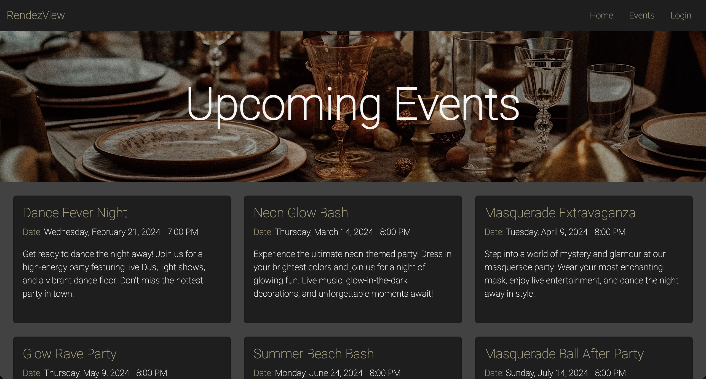
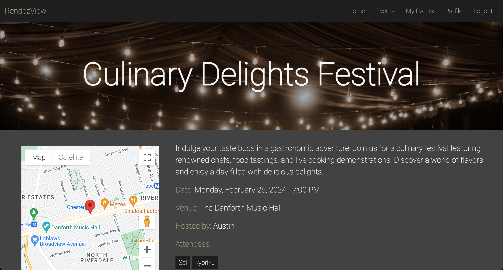
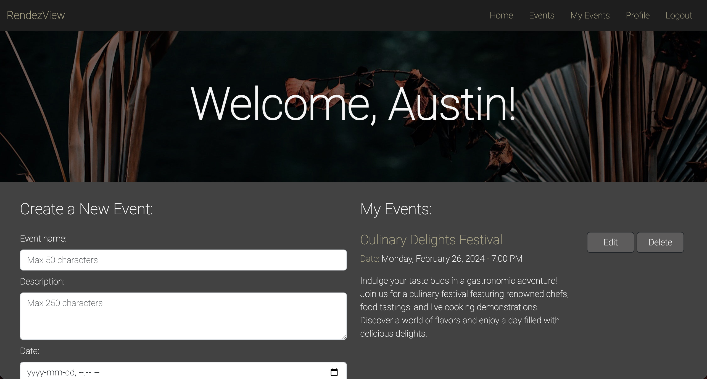
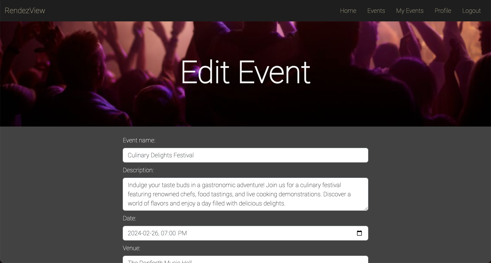

    
    <h3 align="center">RendezView</h3>

Table of Contents

<ol>
    <li><a href="#built-with">Built With</a></li>
    <li><a href="#description">Description</a></li>
    <li><a href="#usage">Usage</a></li>
    <li><a href="#visuals">Visuals</a></li>
    <li><a href="#contributions">Contributions</a></li>
    <li><a href="#roadmap">Roadmap</a></li>
    <li><a href="#license">License</a></li>
    <li><a href="#questions">Questions</a></li>
</ol>

## Built With

(<a href="#readme-top">back to top</a>)

## Description
This is a party planner app that allows users to browse, create, edit, and delete events. The target user(s) for this app includes users who want to host/attend events, party planning companies, party venue owners, and party vendors. 

With so many events happening all the time, it's hard to plan and keep these parties organized. Our app gives users and communities a organized space to view what events are going on and when and where they will be. This app is a great solution for people who attend and host many events to keep them organized in their own dashboard. 

This app is also a great solution for people who are new to the city and are looking for a place to browse events and get to know people. Users do not have to be in certain groups to be able to view these parties and events. It's a great way for people to browse events in the comfort of their own homes without having to find sources elsewhere. 

This app gives a chance for party planning companies, party venue owners, and party vendors to expand their customer base and reach by offering services for hosted events. This will not only give users the ease of having to worry about venues and decorations but also let these companies reach more audience. Party planning companies can use our apps to customize to what vendors and venues they have and make this app their very own platform for their users. 

(<a href="#readme-top">back to top</a>)

## Usage
This app allows users to connect with the community by allowing them to browse parties that other users have created. Logged in users are able to RSVP to the event, letting the host know that they will be attending. At anytime, they are also able to modify their attendance. 

Logged in users are also able to create events by submitting a form to the app. The app will allow you to choose the specified venues that are in the database. In addition to that, the app will also show available vendors that might be able to help you out with the party that's being planned. Once the party is created, it will be shown on the Events page. If user wants to modify their event (name, location, description, or time) they will be able to do that on the events page as well. They will also be able to see who has RSVP'd to the event, keeping track of the capacity. If the user wants to delete the event, that is also possible, and it will be removed from the database.

Users are able to create their own profile to RSVP and create their own events. It will also create a dashboard for them where it showcases the events they are hosting and will be attending in the near future, allowing them to keep everything organized. 

(<a href="#readme-top">back to top</a>)

## Visuals

(<a href="#readme-top">back to top</a>)

## Contributions
In addition to that, some websites that helped with the build of this party planning app include:

- [Prevent Google Maps from loading the Roboto font](https://gist.github.com/boffey/8516b0091649161cb09e244d63076256)

Here are the templates/icons used in the README file:

- The README template is found here: https://github.com/othneildrew/Best-README-Template
- Icon for README: <a href="https://www.flaticon.com/free-icons/daily" title="daily icons">Daily icons created by Freepik - Flaticon</a>
- Build With icons for README: https://ileriayo.github.io/markdown-badges/

(<a href="#readme-top">back to top</a>)

## Roadmap
While we have achieved everything on our MVP, there are aspects of the project we would like to further develop in as well. 

- [ ] Ability to send out invites
    - As a host, having the ability to send out invites to party to specific users 
    - Ability to browse through users to send out invites 
    - Ability to invite certain users as co-host of event as well 

- [ ] Customizable Color Themes
    - Templated platform for party planning companies 
    - Ability for these companies to choose color schemes to use 
    - Full customizable to their color/branding

- [ ] Selected Roles in App
    - Being able to select roles in the app: manager, vendor, user (sign up as these roles)
    - Having different abilities/level of functionality depending on role
    - Manager - customize branding/color, edit/delete all events, add/remove vendors
    - Vendor - able to add themselves in system and update venues they can host

- [ ] Create Restricted Events
     - Ability to create events that are only accessible to invited users only 
     - Allowing certain groups of people to view hosted events 
     - Ability to create private groups in the app and invite users to these groups 

(<a href="#readme-top">back to top</a>)

## License
This application is covered by the [MIT](https://opensource.org/licenses/MIT) license.

(<a href="#readme-top">back to top</a>)

## Questions
For any questions you have, please do not hesitate to reach out to us.

Developers:

- Austin Graham: 
    - Github Username: kyoriku
    - Email: devkyoriku@gmail.com

- Kevin Quach
    - Github Username: quachies
    - Email: quachies@gmail.com 

- Harry MacMillan
    - Github Username: harrymac1972
    - Email: harrymac1972@gmail.com

- Tiffany Chan
    - Github Username: tchan128
    - Email: tchan12899@gmail.com

- Main Github Repo: https://github.com/kyoriku/RendezView
- Deployed Work on Heroku: https://rendezviews-6983bdd1f9ce.herokuapp.com

(<a href="#readme-top">back to top</a>)
