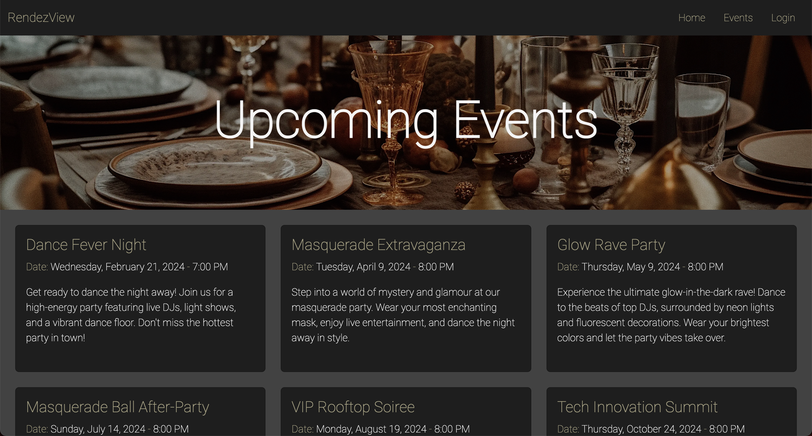
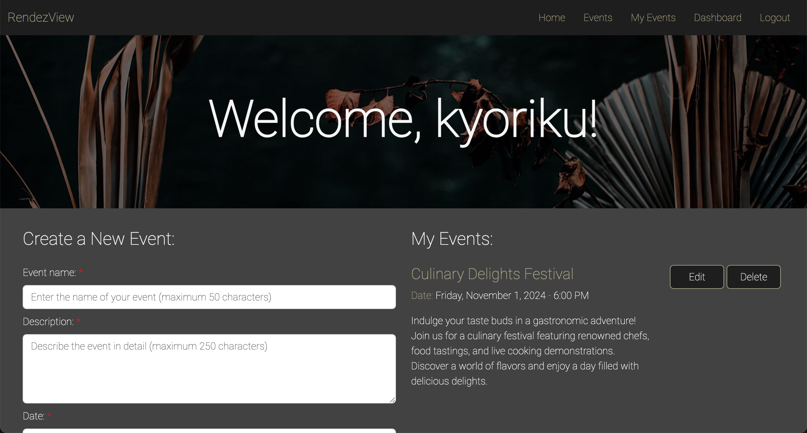
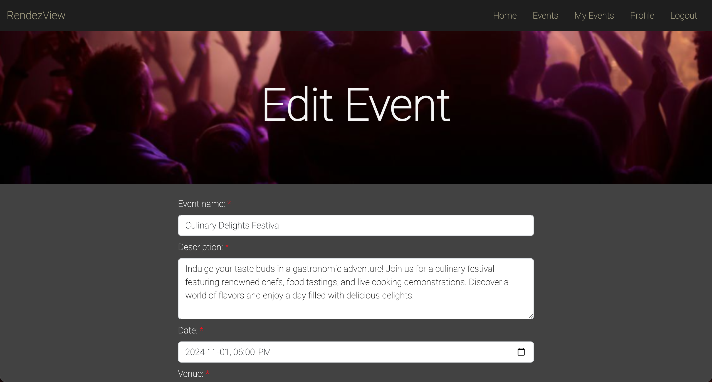

# RendezView
*A full-stack event planning platform built with MVC architecture, featuring event creation, RSVP functionality, and personalized dashboards*

## Built With
[](https://developer.mozilla.org/en-US/docs/Web/JavaScript)
[](https://nodejs.org/en)
[](https://expressjs.com/)
[](https://www.mysql.com/)
[](https://sequelize.org/)
[](https://developer.mozilla.org/en-US/docs/Web/CSS)
[](https://getbootstrap.com/)
[](https://handlebarsjs.com/)
[](https://jquery.com/)

## Table of Contents
- [Description](#description)
  - [Deployed Site](#deployed-site)
- [Features](#features)
- [Screenshots](#screenshots)
- [Technical Details](#technical-details)
- [Installation](#installation)
- [Usage](#usage)
- [Contributing](#contributing)
- [Developers](#developers)
- [License](#license)
- [Questions](#questions)

## Description
RendezView is a full-stack web application designed to streamline event planning and management through an intuitive interface. Built using the Model-View-Controller architectural pattern, this platform provides a robust environment for creating, managing, and discovering events.

The application combines secure user authentication with comprehensive event management features, creating a professional space where users can organize events, manage RSVPs, and track attendance. The seamless integration of Express.js backend with Handlebars.js frontend templating ensures a smooth user experience while maintaining clean code organization through the MVC pattern.

### Deployed Site
Visit the live website at: [https://rendezviews-6983bdd1f9ce.herokuapp.com](https://rendezviews-6983bdd1f9ce.herokuapp.com)

## Features
* **Event Management**
  * Create and publish event listings
  * Edit existing event details
  * Delete unwanted events
  * Flexible venue and address support
  * Real-time updates for event information

* **RSVP System**
  * Track event attendance
  * Manage RSVP status
  * View attendee lists
  * Update RSVP responses
  * Attendance tracking functionality

* **User Authentication**
  * Secure registration and login
  * Session management
  * Protected routes
  * Password encryption
  * User role management

* **Dashboard Interface**
  * Personal event dashboard
  * Created events management
  * RSVP event tracking
  * Event history view
  * User profile management

## Screenshots






## Technical Details
This event planning application was built using the following technologies and patterns:

* **MVC Architecture**: 
  * Models: Sequelize ORM model definitions with relationships and validations
  * Views: Handlebars template engine with nested layouts and partials
  * Controllers: Express.js route handlers separated into API and view routes
  * Custom middleware with `withAuth` for protected routes
  * Service separation for geocoding functionality

* **Database Architecture**:
  * `User` model with bcrypt password hashing hooks
  * `Event` model with venue foreign key constraints
  * `RSVP` junction table for Many-to-Many relationships
  * `Venue` model with decimal precision coordinates
  * Sequelize associations using `belongsTo`, `hasMany`, and `belongsToMany`

* **Geocoding Implementation**:
  * Axios HTTP client for Nominatim API requests
  * Async/await pattern for coordinate fetching
  * Custom User-Agent headers for API compliance
  * Error handling for failed geocoding attempts
  * Leaflet.js integration for map rendering

* **Session Management**:
  * Express-session middleware configuration
  * Session persistence in database
  * Custom redirect handling for protected routes
  * Session destruction on logout
  * Error state management in session

* **Template System**:
  * Custom Handlebars helper functions
  * Conditional rendering with session checks
  * Partial views for navigation and footer
  * Client-side script injection
  * Dynamic content rendering based on user state

* **Frontend JavaScript**:
  * AJAX calls using `fetch` API
  * Event delegation patterns for dynamic content
  * Form data serialization and validation
  * Loading state triggers and spinners
  * DOM manipulation for real-time updates

## Installation
To run this project locally:

1. Clone the repository
    ```bash
    git clone https://github.com/kyoriku/RendezView.git
    ```

2. Navigate to the project directory
    ```bash
    cd RendezView
    ```

3. Install dependencies
    ```bash
    npm install
    ```

4. Create a `.env` file with the following variables
    ```bash
    DB_NAME='rendezview_db'
    DB_USER='your_MySQL_username'
    DB_PASSWORD='your_MySQL_password'
    SESSION_SECRET='your_session_secret'
    ```

5. Set up the database
    ```bash
    mysql -u root -p
    source db/schema.sql
    ```

6. (Optional) Seed the database
    ```bash
    npm run seed
    ```

## Usage
1. Start the server
    ```bash
    npm start
    ```

2. Access the application at `http://localhost:3001`

3. Create an account to:
   * Create and manage events
   * RSVP to events
   * Track event attendance
   * View your event dashboard

## Contributing
Contributions are welcome! Here are ways you can help:

1. Fork the repository
2. Create a feature branch
    ```bash
    git checkout -b feature/YourFeature
    ```
3. Make your changes - this could include:
    * Adding new features
    * Improving the UI/UX
    * Optimizing database queries
    * Enhancing security
    * Bug fixes
4. Commit your changes
5. Push to your branch
6. Open a Pull Request

Please ensure your contributions:
* Follow the existing code style
* Include appropriate error handling
* Test all changes locally
* Include clear descriptions in your pull request

## Developers
* [](https://github.com/kyoriku) - Lead Developer: Full Backend Architecture & Implementation, Core Feature Development
* [](https://github.com/harrymac1972) - Backend Support, Model Development
* [](https://github.com/quachies) - Frontend Development, UI/UX Design
* [](https://github.com/tchan128) - Frontend Support, UI/UX Wireframing

## License
[](https://opensource.org/licenses/MIT)

This project is licensed under the [MIT](https://opensource.org/licenses/MIT) license - see the LICENSE file for details.

## Questions
For any questions, feel free to email me at devkyoriku@gmail.com.